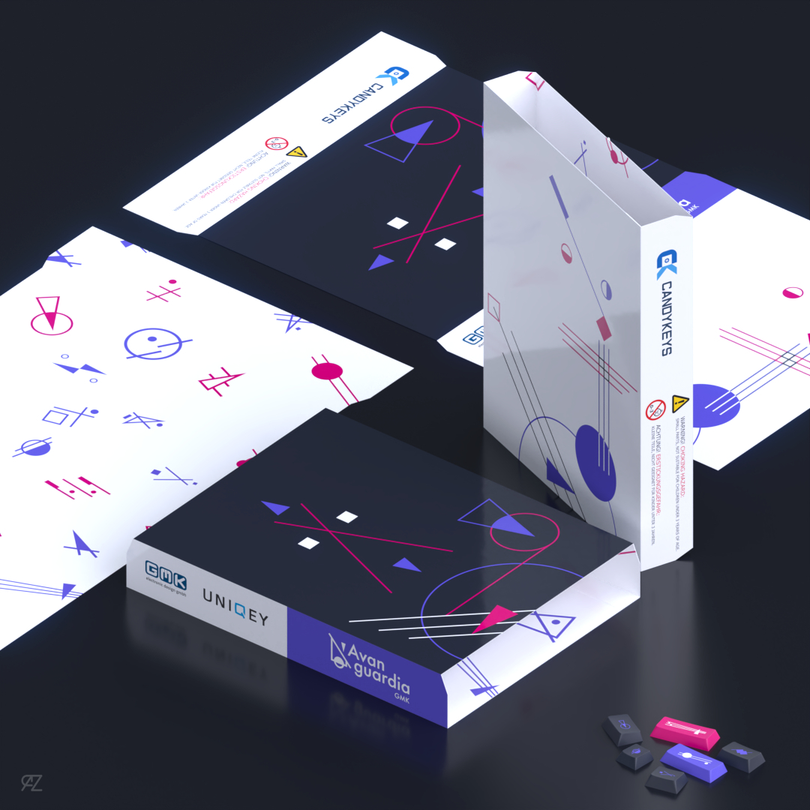

# GMK Avanguardia GB date is here!

Finally, after months of iterations I can finally announce a GB date: **15th December** - **15th January**.
Right now me and the proxies involved are setting up prices and organizing everything for the launch. I'm glad to announce a collaboration with [Artkey](https://artkeyuniverse.com/) for a good looking artisan AND more to come in the next days (I hope).

Another bit update is that I reached out [Switchkeys](https://www.switchkeys.com.au/) and [Vala Supply](https://vala.supply/), so I'm happy to say we have **Oceania** and **US** **proxies**!

Proxy Recap

| Region    | Vendor                               |
| --------- | ------------------------------------ |
| Europe    | [Candykeys](https://candykeys.com/)  |
| Asia      | [iLumkb](https://ilumkb.com/)        |
| Canada    | [Deskhero](https://www.deskhero.ca/) |
| USA       | [Vala Supply](https://vala.supply/)  |
| Oceania   | [Switchkeys](https://www.switchkeys.com.au/)  |

As you may saw in my [Instagram page](https://instagram.com/razorsim) (*follow me for updates*) I've made a packaging concept too:

What else? I'm working hard to make this GB as perfect as possible. More news for other collaborations will come soon™, untill then I would like to thank you all for the great support: this GB is possible only cause of you guys!

PS: you've may noticed that there's a new section on the website ([Updats](https://raz.works/updates)). I'll try to post updates on my GBs and new projects here, so the infos are more easily sharable on the web!

You can join [my discord server](https://discord.gg/Mn2Ty3y) and the [italian community discord server](https://discord.gg/DAW7CsDuHP) by clicking those links! These are the places where I'm most active so if you've questions, just join 😁

Peace out!